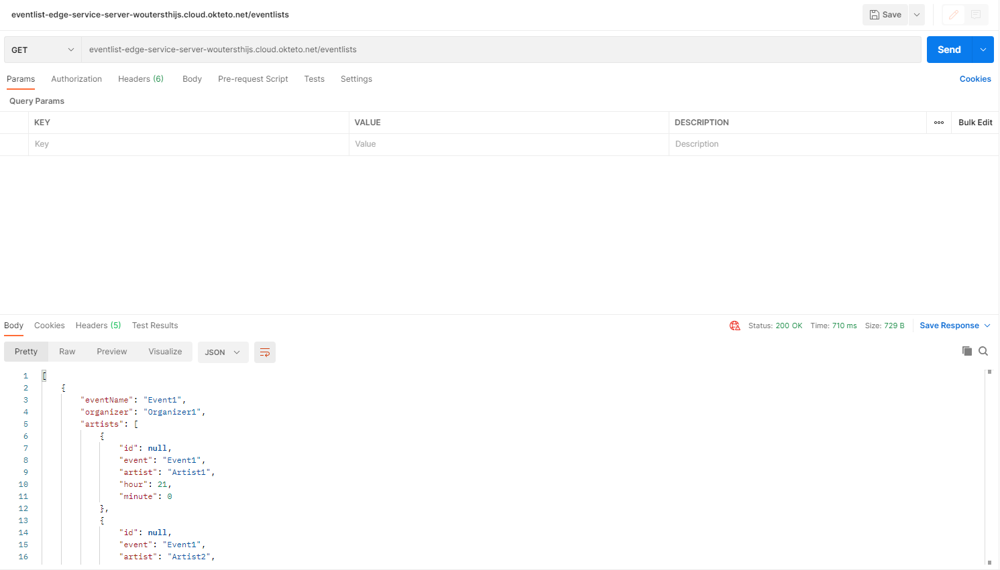
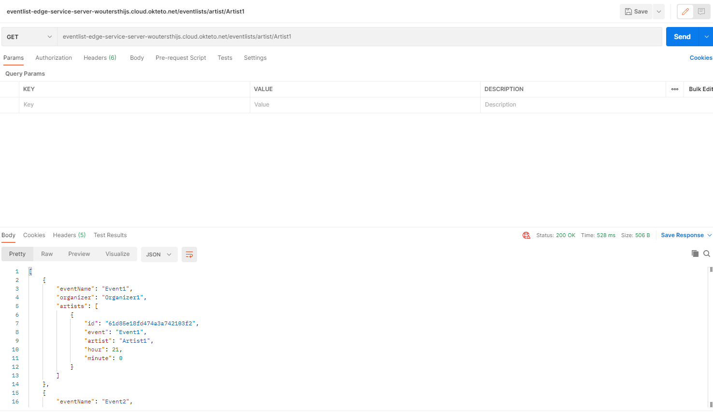
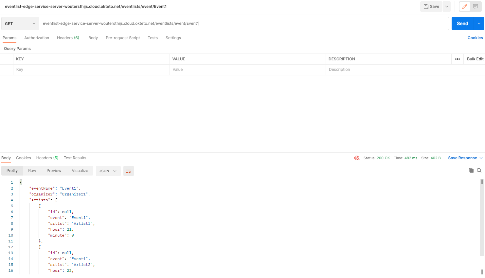
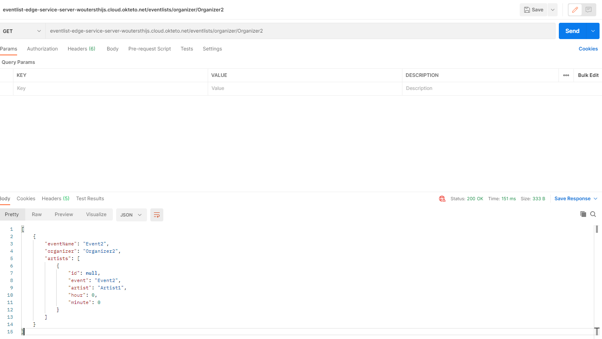
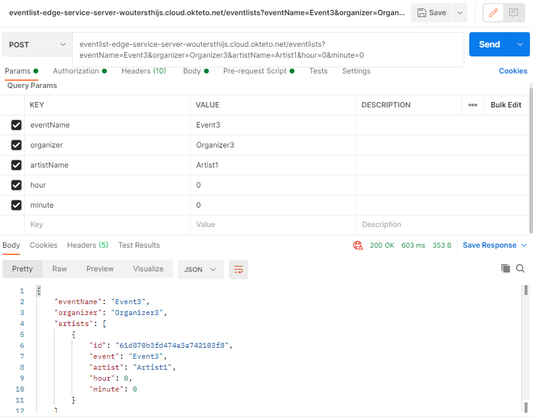
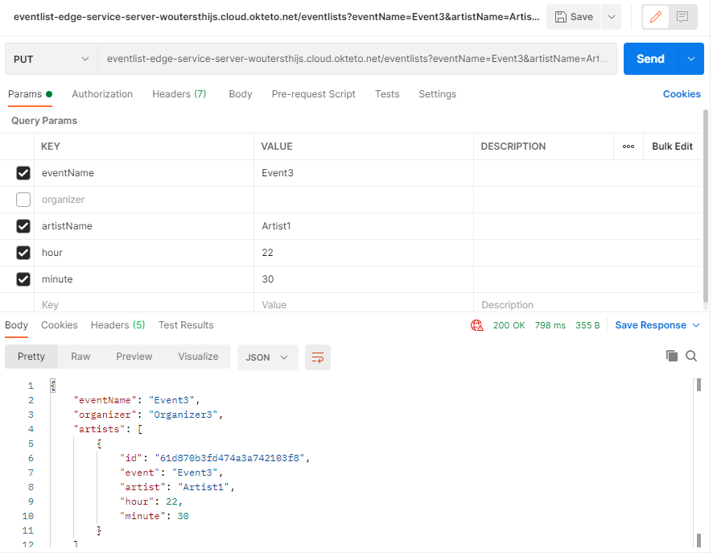
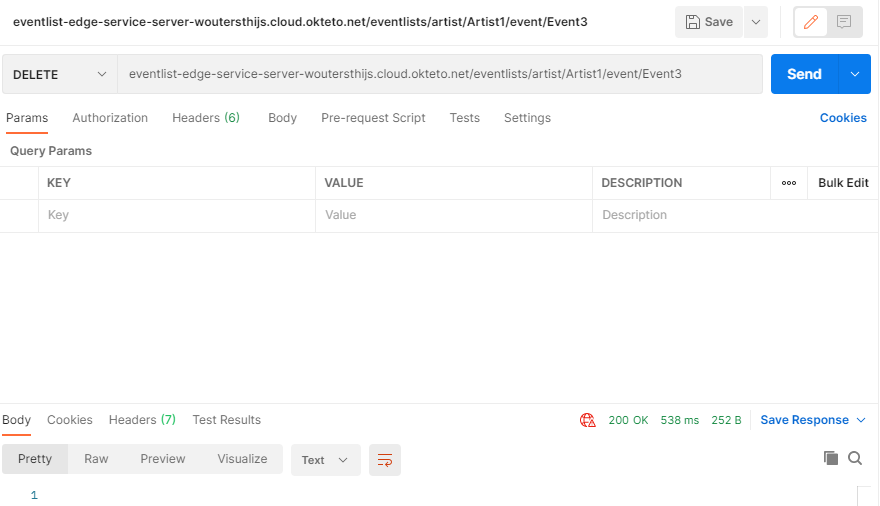
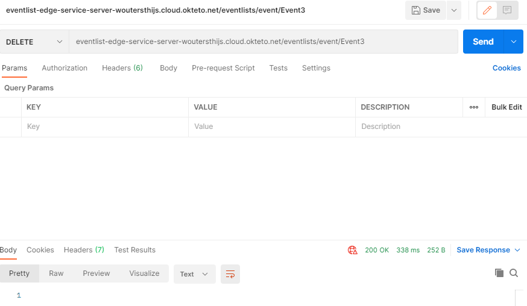

### GET /eventlists

### GET /eventlists/artist/Artist1

### GET /eventlists/event/Event1

### GET /eventlists/organizer/Organizer2

### POST /eventlists?eventName=Event3&organizer=Organizer3&artistName=Artist1&hour=0&minute=0

### PUT /eventlists?eventName=Event3&artistName=Artist1&hour=22&minute=30

### DELETE /eventlists/artist/Artist1/event/Event3

### DELETE /eventlists/event/Event3

