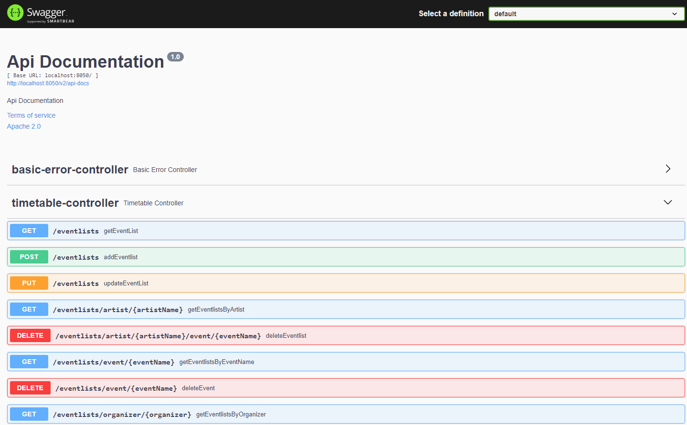

# apt-eventlist-edge-service

## Beschrijving
Het thema dat we gekozen hebben is timetables. In de back-end services komt een event-service die alle evenementen met hun organisator opslaat en een artist-service die de artiesten opslaat met het tijdstip dat ze spelen, op welk evenement en hun naam.

Op de edge service komen deze 2 back-end services samen om een volledige timetable te geven van bv. een evenement, die dan alle artiesten die spelen op dit evenement toont. Andersom kan je ook een artiest opzoeken, waarbij alle evenementen + tijdstip komen waar deze artiest speelt.

## Diagram
- Event-service: [https://github.com/WoutersThijs/apt-event-service](https://github.com/WoutersThijs/apt-event-service)
- Artist-service: [https://github.com/WoutersThijs/apt-artist-service](https://github.com/WoutersThijs/apt-artist-service)

## Swagger UI

## Postman Requests on Edge
Link to Postman requests file: [Postman Requests](POSTMANREQUESTS.md)